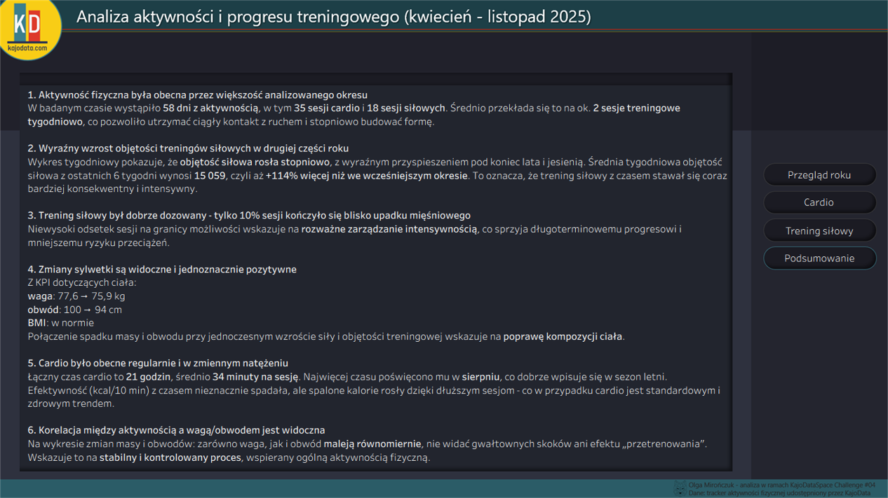

# Training Activity & Progress Analysis (April – November 2025)

## 1. Project Goal

The goal of this project is to analyze the activity log shared by **Kajo Rudziński** as part of the **KajoDataSpace Challenge #04** and to create an interactive dashboard presenting:

- overall activity,
- strength development,
- cardio efficiency,
- body changes,
- key observations and insights.

The dashboard was created in **Tableau Public**, and all input data was cleaned and standardized using **Power Query (Excel)**.

---

## 2. Dashboard Link

Public dashboard:  
👉 https://public.tableau.com/views/AnalizaAktywnociFizycznejiZdrowia/Przegldroku

---

## 3. Repository Structure

```
├── data/
│   ├── male_cwiczenia.csv
│   ├── waga_i_obwod.csv
│   ├── max_pull_up.csv
│   ├── sztanga.csv
│   ├── orbitrek.csv
│   ├── cwiczenia_ogolne.csv
│   └── mapping_cwiczenia_miesnie.csv
│
├── screenshot/
│   ├── 1.png
│   ├── 2.png
│   ├── 3.png
│   ├── 4.png
│
├── opis_oczyszczania_danych.md
└── README.md
```

All `.csv` files are cleaned datasets prepared in Power Query.

---

## 4. Data Cleaning & Preparation

Full documentation is available in:  
📄 **[data_cleaning_process.md](data_cleaning_process.md)**

Key steps:

### ✔ Column name standardization  
Field names were unified, e.g. `Dzień → dzien`, `Waga(kg) → waga_kg`, `Komentarz → komentarz`.

### ✔ Removal of unnecessary columns  
Blank fields, conversion artifacts, and helper columns were removed.

### ✔ Data type transformation  
Key fields were assigned consistent types:
- `date` – training dates  
- `time` – duration (strength rest times / cardio minutes converted to time)  
- `int` – repetitions, sets, weights  
- `text` – exercise names, comments  

### ✔ Additional calculated fields  
Depending on the table, new variables include:
- cardio duration converted to `time`,
- strength training volume,
- primary muscle group (`partia_glowna`) based on mapping or conditional logic,
- helper columns for aggregation and KPI calculations.

### ✔ Linking strength training data with muscle mapping  
Allows generating “volume per muscle group” charts and the muscle load silhouette.

---

## 5. Key Metrics Used in the Dashboard

Below is a high-level description of core KPIs (without Tableau formulas):

### 🔹 Active days
Number of unique days that included:
- strength training,  
- general exercises,  
- Orbitrek or cardio.  

### 🔹 Number of cardio / strength sessions
Number of **days** containing at least one session of the selected activity type.  
If multiple entries occur on the same day, they still count as **one session**.

### 🔹 Strength training volume
`volume = repetitions × sets × weight`  
(Dumbbell exercises multiplied ×2)

### 🔹 Muscle load level
Current load of each muscle group (based on the last 3 training sessions), scaled relative to its historical minimum and maximum:

- **0%** = the lowest recorded volume for this muscle  
- **100%** = the highest recorded volume for this muscle  

### 🔹 Cardio efficiency
- kcal per 10 minutes,  
- training duration in `time` format.

---

## 6. Dashboard Pages

### **1) Annual Overview**
Includes:
- activity, strength, and body composition KPIs  
- activity calendar  
- monthly activity structure  
- weight and circumference over time  

→ Purpose: a quick overview of the entire training period.

### **2) Cardio**
- Orbitrek performance over time  
- calorie burn and efficiency  
- cardio calendar  
- total monthly cardio duration  

→ Purpose: understanding endurance trends.

### **3) Strength Training**
- weekly strength volume  
- muscle-group volume (60-day window)  
- silhouette with muscle load  

→ Purpose: analyzing strength progress and muscular load distribution.

### **4) Summary**
Key analytical findings presented in bullet points, focusing on progress, regularity, risks, and body changes.

---

## 7. Screenshots




---

## 8. Technology

- **Tableau Public** – main visualization tool  
- **Excel + Power Query** – data cleaning and processing  
- **Markdown** – documentation  

---

## 9. Author

Created by **Olga Mirończuk**  
As part of **KajoDataSpace Challenge #04**  
Data provided by **KajoData**

---

## 10. License

This project is available for educational and portfolio purposes.
