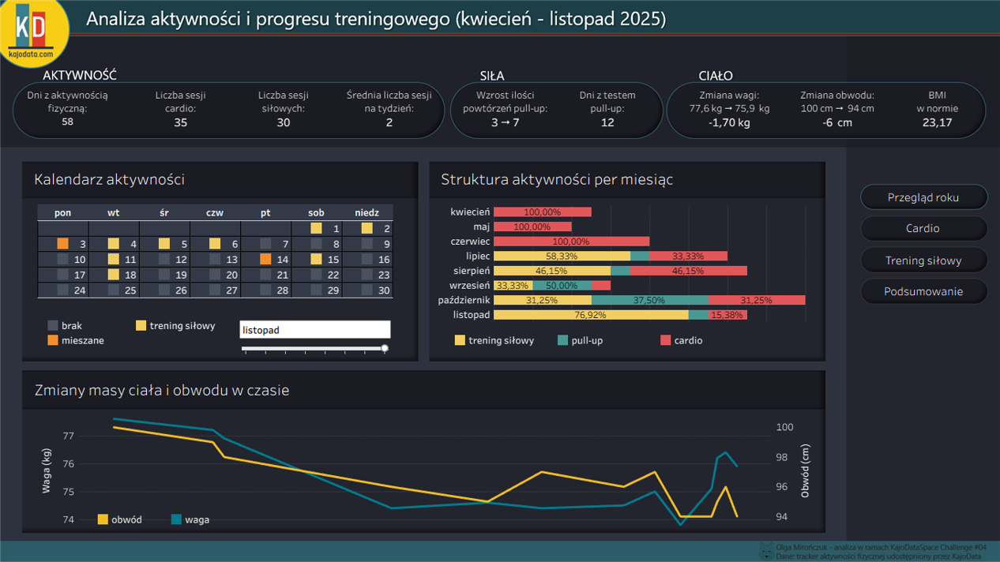
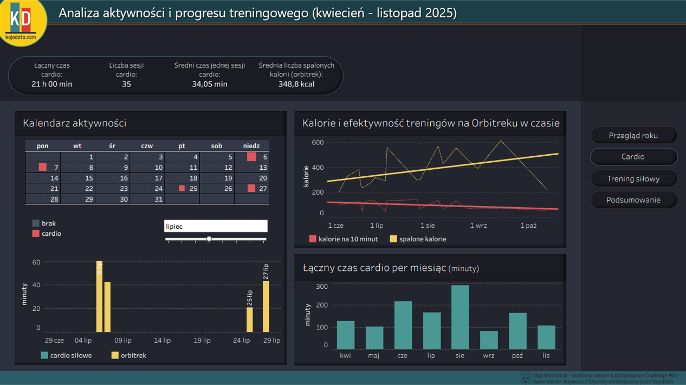
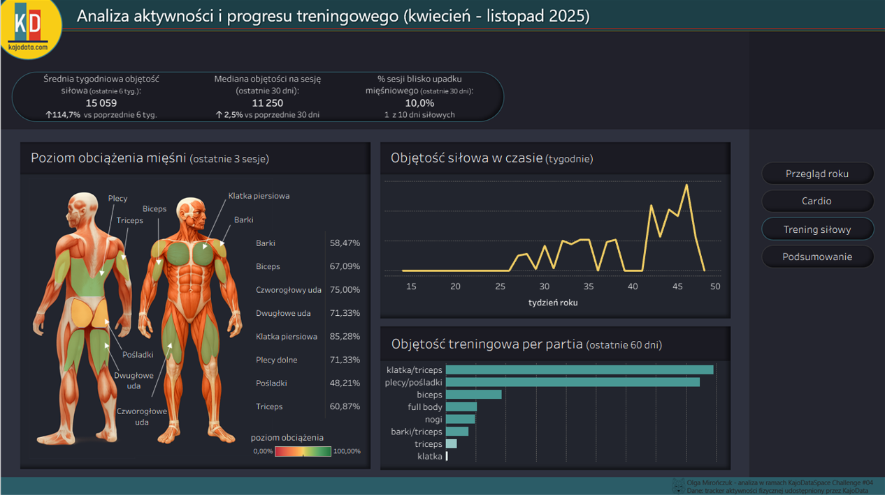

# Analiza Aktywności i Postępów Treningowych (kwiecień – listopad 2025)

## 1. Cel projektu

Celem tego projektu jest analiza danych z dziennika aktywności udostępnionego przez **Kaja Rudzińskiego** w ramach **KajoDataSpace Challenge #04** oraz stworzenie interaktywnego dashboardu prezentującego:

- ogólną aktywność,
- rozwój siły,
- efektywność cardio,
- zmiany w ciele,
- kluczowe obserwacje i wnioski.

Dashboard został stworzony w **Tableau Public**, a wszystkie dane wejściowe zostały oczyszczone i wystandaryzowane za pomocą **Power Query (Excel)**.

---

## 2. Link do dashboardu

Publiczny dashboard:  
👉 [https://public.tableau.com/views/AnalizaAktywnociFizycznejiZdrowia/Przegldroku](https://olgamironczuk.my.canva.site/home/#konkurs-kajodataspace)

---

## 3. Struktura repozytorium

```
├── data/
│   ├── male_cwiczenia.csv
│   ├── waga_i_obwod.csv
│   ├── max_pull_up.csv
│   ├── sztanga.csv
│   ├── orbitrek.csv
│   ├── cwiczenia_ogolne.csv
│   └── mapping_cwiczenia_miesnie.csv
│
├── screenshot/
│   ├── 1.png
│   ├── 2.png
│   ├── 3.png
│   ├── 4.png
│
├── opis_oczyszczania_danych.md
└── README.md
```

Wszystkie pliki `.csv` to oczyszczone zestawy danych przygotowane w Power Query.

---

## 4. Czyszczenie i przygotowanie danych

Pełna dokumentacja dostępna jest w:  
📄 **[opis_oczyszczania_danych.md](opis_oczyszczania_danych.md)**

Najważniejsze kroki:

### ✔ Ujednolicenie nazw kolumn  
Nazwy pól zostały zunifikowane, np. `Dzień → dzien`, `Waga(kg) → waga_kg`, `Komentarz → komentarz`.

### ✔ Usunięcie zbędnych kolumn  
Usunięto puste pola, artefakty konwersji oraz tymczasowe kolumny pomocnicze.

### ✔ Transformacja typów danych  
Kluczowe pola otrzymały spójne typy:

- `date` – daty treningów  
- `time` – czas trwania (minuty cardio lub czas przerw treningowych po konwersji)  
- `int` – powtórzenia, serie, ciężary  
- `text` – nazwy ćwiczeń, komentarze  

### ✔ Dodatkowe pola obliczone  
W zależności od tabeli dodano m.in.:

- czas cardio przekonwertowany na format `time`,
- objętość treningu siłowego,
- główną partię mięśniową (`partia_glowna`) na podstawie mapowania lub logiki warunkowej,
- pola pomocnicze do agregacji i obliczania KPI.

### ✔ Powiązanie danych siłowych z mapowaniem mięśni  
Umożliwia tworzenie wykresów „objętość na partię mięśniową” oraz sylwetki z poziomem obciążenia mięśni.

---

## 5. Kluczowe metryki użyte w dashboardzie

Poniżej ogólny opis głównych KPI (bez formuł Tableau):

### 🔹 Dni z aktywnością  
Liczba unikalnych dni, w których pojawiła się:

- aktywność siłowa,  
- ćwiczenia ogólne,  
- Orbitrek lub inne cardio.  

### 🔹 Liczba sesji cardio / siłowych  
Liczba **dni**, w których wystąpiła dana aktywność.  
Jeśli jednego dnia było więcej niż jedno wejście — liczone jako **jedna sesja**.

### 🔹 Objętość treningu siłowego  
`objętość = powtorzenia × serie × waga`  
(Ćwiczenia hantlami mnożone ×2)

### 🔹 Poziom obciążenia partii mięśniowych  
Aktualny poziom obciążenia każdej partii mięśniowej (na podstawie 3 ostatnich treningów), przeskalowany względem jej historycznego minimum i maksimum:

- **0%** = najniższa zarejestrowana objętość  
- **100%** = najwyższa zarejestrowana objętość  

### 🔹 Efektywność cardio  
- kcal na 10 minut,  
- czas trwania treningu w formacie `time`.

---

## 6. Strony dashboardu

### **1) Przegląd roku**
Zawiera:
- KPI aktywności, siły i składu ciała  
- kalendarz aktywności  
- miesięczną strukturę aktywności  
- wagę i obwody w czasie  

→ Cel: szybki przegląd całego okresu treningowego.

---

### **2) Cardio**
- wyniki Orbitreka w czasie  
- spalane kalorie i efektywność  
- kalendarz cardio  
- miesięczny czas cardio  

→ Cel: zrozumienie trendów wytrzymałościowych.

---

### **3) Trening siłowy**
- tygodniowa objętość siłowa  
- objętość partii mięśniowych (okno 60-dniowe)  
- sylwetka z poziomem obciążenia  

→ Cel: analiza postępu siłowego i rozkładu obciążenia mięśni.

---

### **4) Podsumowanie**
Kluczowe wnioski przedstawione w punktach, koncentrujące się na progresie, regularności, ryzykach i zmianach w ciele.

---

## 7. Zrzuty ekranu

  
  
  


---

## 8. Technologia

- **Tableau Public** – główne narzędzie wizualizacji  
- **Excel + Power Query** – czyszczenie i przygotowanie danych  
- **Markdown** – dokumentacja  

---

## 9. Autor

Projekt wykonany przez **Olgę Mirończuk**  
W ramach **KajoDataSpace Challenge #04**  
Dane dostarczone przez **KajoData**

---

## 10. Licencja

Projekt dostępny w celach edukacyjnych i portfolio.
